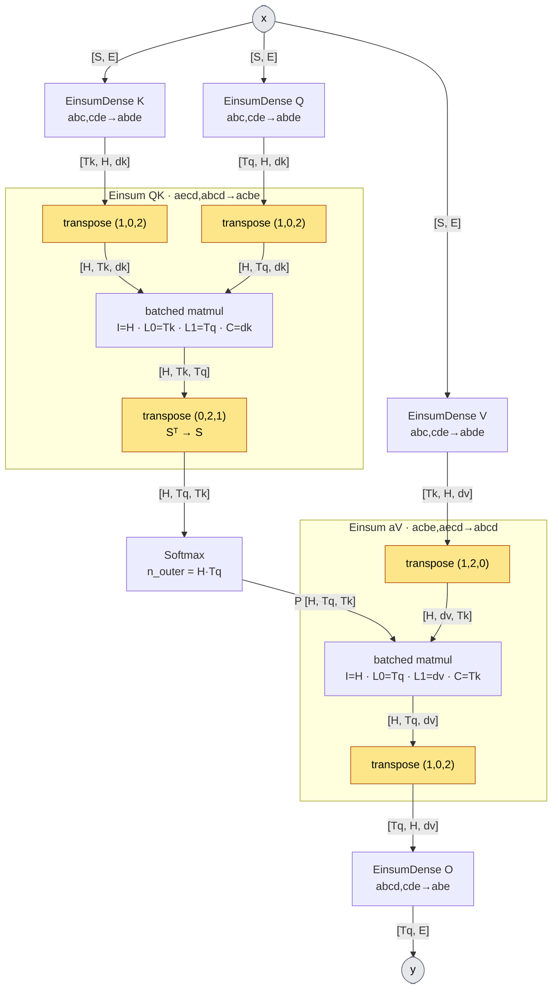
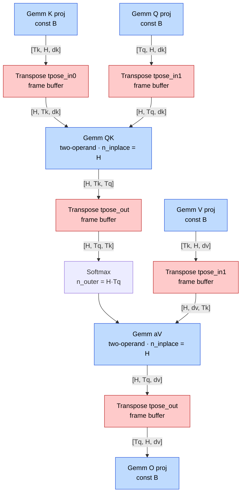

# Multi-head attention on the GEMM path: graph transforms

This doc covers how hls4ml-gemm lowers multi-head attention (MHA) under `Strategy: GEMM`. It first describes
what upstream hls4ml (merge base `e998745`) does and why that is a poor fit for a streaming GEMM IP. It then
describes what the GEMM path changes, adds and removes, and what that buys.

Sources: `converters/keras_v3/hgq2/multi_head_attention.py`, `utils/einsum_utils.py`,
`backends/vivado/vivado_backend.py:init_einsum*`, `templates/vivado/nnet_utils/nnet_einsum.h` (baseline);
`backends/fpga/gemm/attention_heads.py`, `backends/fpga/gemm/gemm_nodes.py`,
`backends/fpga/passes/split_merge_nodes.py`, `templates/*/nnet_utils/nnet_split_merge.h` (GEMM path).

Notation, for self-attention with one sequence axis:
- `S`: sequence length (`Tq`/`Tk` where queries and keys must be distinguished);
- `H`: number of heads;
- `dk`: key_dim;
- `dv`: value_dim;
- `E`: model embedding width;
- `D = H·dk`: the projection width.

The batch axis is omitted throughout.

---

## 1. Baseline: how upstream hls4ml represents MHA

### 1.1 Decomposition at conversion

The HGQ2 converter does not keep MHA as one layer. `QMultiHeadAttentionHandler` expands it into seven hls4ml
layers, reusing Keras's own einsum equations:

| # | Node | Keras equation | Inputs → output shape |
|---|---|---|---|
| 1 | `Q` projection, EinsumDense | `abc,cde->abde` | `[S, E]` → `[S, H, dk]` |
| 2 | `K` projection, EinsumDense | `abc,cde->abde` | `[S, E]` → `[S, H, dk]` |
| 3 | `V` projection, EinsumDense | `abc,cde->abde` | `[S, E]` → `[S, H, dv]` |
| 4 | `QK` Einsum (dot product) | `aecd,abcd->acbe` | `K [Tk, H, dk]`, `Q [Tq, H, dk]` → scores `[H, Tq, Tk]` |
| 5 | Softmax | over the last axis | `[H, Tq, Tk]` → `[H, Tq, Tk]` |
| 6 | `aV` Einsum (combine) | `acbe,aecd->abcd` | `P [H, Tq, Tk]`, `V [Tk, H, dv]` → `[Tq, H, dv]` |
| 7 | `O` projection, EinsumDense | `abcd,cde->abe` | `[Tq, H, dv]` → `[Tq, E]` |

The projections carry the head as a separate tensor axis (`[S, H, dk]`). The two matmuls are batched over heads.

### 1.2 How hls4ml executes an Einsum

`parse_einsum` (in `einsum_utils.py`) reduces any two-operand einsum to one canonical batched matmul:

```
out[I, L0, L1] = sum_C  in0[I, L0, C] · in1[I, L1, C]
```

Here I is the "in-place" (batch) axes, L0 and L1 are the free axes of each operand, and C is the contracted
axes. It returns three permutations that move each operand into that order and the output back out:
`inp0_tpose_idxs`, `inp1_tpose_idxs`, `out_tpose_idxs`.

`nnet::einsum` (baseline `nnet_einsum.h`) does exactly that:
1. transpose `in0`;
2. transpose `in1`;
3. run a fully unrolled `I × L0 × L1 × C` MAC nest;
4. transpose the result.

Worked through for MHA, the permutations are:

| Einsum | I | L0 | L1 | C | in0 perm | in1 perm | out perm |
|---|---|---|---|---|---|---|---|
| QK (`in0=K`, `in1=Q`) | H | Tk | Tq | dk | `K [Tk,H,dk] → [H,Tk,dk]` (1,0,2) | `Q [Tq,H,dk] → [H,Tq,dk]` (1,0,2) | `[H,Tk,Tq] → [H,Tq,Tk]` (0,2,1) |
| aV (`in0=P`, `in1=V`) | H | Tq | dv | Tk | identity | `V [Tk,H,dv] → [H,dv,Tk]` (1,2,0) | `[H,Tq,dv] → [Tq,H,dv]` (1,0,2) |

Every attention block therefore carries **five non-identity transposes**:
- **Three move the head axis:** K and Q to the front for QK, and the aV output back to `[Tq, H, dv]`.
- **One flips the QK score:** Keras's operand order (`K` first) makes the canonical GEMM compute Sᵀ
  (`[H, Tk, Tq]`), so it must be transposed back to `[H, Tq, Tk]` for the softmax.
- **One reorients V:** it puts the contracted axis (`Tk`) last for aV.

The softmax runs over `n_outer = H·Tq` rows of length `Tk`.

Baseline graph. Each `nnet::einsum` performs its transposes internally; they are drawn here as separate boxes
(amber) so the five reorders are visible:



### 1.3 What the baseline supports

- **Einsum and EinsumDense are `io_parallel` only.** The Vivado templates assert it: "EinsumDense layer only
  supports io_parallel". EinsumDense is Latency (or distributed arithmetic) only.
- **In `io_parallel`, a transpose is free:** every tensor is a fully partitioned array, so a permutation is
  wiring. But everything is also **fully unrolled**:
  - QK alone is `H·Tq·Tk·dk` multipliers;
  - aV is `H·Tq·dv·Tk`;
  - `reuse_factor` only sets a pipeline II and multiplier cap on the same monolithic kernel.
- **Attention cannot be streamed at all.**

### 1.4 The problem for a streaming GEMM IP

A GEMM IP (Section 2) consumes and produces **streams of rows**: one K-wide A row per beat and one N-wide result
row per beat, plus B either baked in or streamed per frame. The baseline graph maps badly onto that:

1. **Transposes stop being free.** Under `io_stream`, a tensor is a sequence of beats in a fixed order.
   Permuting an axis that crosses the beat order (head ↔ sequence, `Tq` ↔ `Tk`) needs a **whole-tensor reorder
   buffer**:
   - the entire tensor is stored before the first reordered beat can leave;
   - memory is `S·D` (or `H·Tq·Tk` for the score);
   - latency is one full frame per transpose;
   - with five per block, that is five frame-sized stalls and buffers in series on the attention critical path.
2. **The head axis is in the wrong place.** In the baseline, head is a tensor axis between sequence and
   feature (`[S, H, dk]`), and the einsum makes it the outer batch axis `I`. A GEMM IP computes one matmul per
   call, so a lowering that keeps the head as `I` needs either an `n_inplace = H` batched call walking heads in
   stream order, or a head-major stream. Either way, the head-move transposes above come back.
3. **Operand roles are arbitrary.** Keras feeds `K` as `in0`, so the canonical product is Sᵀ, and an extra
   transpose exists purely because of operand order.
4. **No per-head parallelism.** One batched einsum node means one kernel. There is no graph-level way to give
   each head its own IP instance, or to overlap heads.

The first-pass generic lowering (`LowerEinsumToGemm` on its own) shows the problem directly: it lowers each
einsum to a canonical `Gemm` and materializes every non-identity permutation as a physical `Transpose` node, so
MHA arrives at the IP with **five whole-tensor transposes per block**:



Each red box stores a whole tensor before emitting its first reordered beat.

---

## 2. The GEMM path: what changes

### 2.1 Where it runs

- `SplitAttentionHeads` (`backends/fpga/gemm/attention_heads.py`) is an optimizer pass in the shared FPGA base.
  Catapult runs it in the `optimize` flow, **before** `LowerEinsumToGemm`.
- It matches the QK Einsum (`strategy == 'gemm'`) whose only consumer is a Softmax.
- From there it walks forward to the aV Einsum and the O projection, and backward to the Q/K/V projections.
  It skips any `FixedPointQuantizer` in between and requires all four projections to be EinsumDense.
- It consumes the QK/Softmax/aV nodes itself. The projections are left for the generic `LowerEinsumToGemm`,
  which turns them into ordinary const-weight GEMMs.

### 2.2 The rewrite

| Step | Baseline | GEMM path |
|---|---|---|
| Projection output | `[S, H, dk]`: head is a tensor axis | **`[S, D]`**: head is a lane inside the beat. Only a relabel: row-major `[S,H,dk]` and `[S, H·dk]` are the same bytes. |
| Head separation | the three head-move transposes | **`HeadSplit`** per projection: 1 × `[S, D]` → H × `[S, dk]`. **Added.** |
| QK | 1 batched Einsum, `I=H`, `in0=K`, `in1=Q`, output Sᵀ + transpose | **H two-operand Gemms**, `A = Q_h`, `B = K_h`: M = Tq, K = dk, N = Tk, output `[Tq, Tk]` directly. **Replaced.** |
| Softmax | 1 node, `n_outer = H·Tq` | **H Softmax nodes**, `n_outer = Tq`, `n_slice = Tk`, bit-exact tables copied. **Replaced.** |
| aV | 1 batched Einsum + V transpose + output head-move | **H two-operand Gemms**, `A = P_h`, `B = V_h`: M = Tq, K = Tk, N = dv. **Replaced.** |
| Head recombination | output transpose to `[Tq, H, dv]` | **`HeadMerge`**: H × `[Tq, dk]` → `[Tq, D]`. **Added.** |
| O projection | reads `[Tq, H, dv]` | rewired to read the merged `[Tq, D]` (same flat data; it contracts `H·dv`). **Rewired.** |
| Quantizers between the ops | one per tensor | cloned per head, each with its head's slice of the precision mask. **Replaced.** |
| Physical transposes | 5 per block, all whole-tensor | **0 by default; at most one small 2D one per head per matmul** (2.4). |

Resulting per-block graph, drawn with H = 2. The dashed V transpose exists only when aV is column-major (the
default); with aV row-major it disappears. The K transpose, needed for QK row-major, is not drawn.

```mermaid
flowchart TD
    x(["x"]):::io
    Qp["Gemm Q proj<br/>const B"]:::gemm
    Kp["Gemm K proj<br/>const B"]:::gemm
    Vp["Gemm V proj<br/>const B"]:::gemm
    sQ["HeadSplit Q<br/>lane slice"]:::new
    sK["HeadSplit K<br/>lane slice"]:::new
    sV["HeadSplit V<br/>lane slice"]:::new

    subgraph h0 ["head 0"]
        qk0["Gemm QK_h0<br/>A=Q_h · B=K_h<br/>M=Tq K=dk N=Tk"]:::gemm
        sm0["Softmax_h0<br/>n_outer=Tq"]
        vt0["Transpose vt_h0<br/>only if aV col-major"]:::opt
        av0["Gemm aV_h0<br/>A=P_h · B=V_h<br/>M=Tq K=Tk N=dv"]:::gemm
    end
    subgraph h1 ["head 1"]
        qk1["Gemm QK_h1"]:::gemm
        sm1["Softmax_h1"]
        vt1["Transpose vt_h1"]:::opt
        av1["Gemm aV_h1"]:::gemm
    end

    hm["HeadMerge<br/>lane concat"]:::new
    Op["Gemm O proj<br/>const B"]:::gemm
    y(["y"]):::io

    x -- "[S, E]" --> Qp & Kp & Vp
    Qp -- "[S, D]" --> sQ
    Kp -- "[S, D]" --> sK
    Vp -- "[S, D]" --> sV
    sQ -- "Q_0 [Tq, dk]" --> qk0
    sK -- "K_0 [Tk, dk]" --> qk0
    qk0 -- "[Tq, Tk]" --> sm0 -- "P_0 [Tq, Tk]" --> av0
    sV -- "V_0 [Tk, dv]" -.-> vt0 -. "[dv, Tk]" .-> av0
    sQ -- "Q_1" --> qk1
    sK -- "K_1" --> qk1
    qk1 --> sm1 --> av1
    sV -- "V_1" -.-> vt1 -.-> av1
    av0 -- "[Tq, dv]" --> hm
    av1 -- "[Tq, dv]" --> hm
    hm -- "[Tq, D]" --> Op -- "[Tq, E]" --> y

    classDef gemm fill:#bfdbfe,stroke:#1d4ed8,color:#000
    classDef new fill:#bbf7d0,stroke:#15803d,color:#000
    classDef opt fill:#fef3c7,stroke:#b45309,stroke-dasharray:4 3,color:#000
    classDef io fill:#e5e7eb,stroke:#6b7280,color:#000
```

Legend: blue = GEMM IP call, green = added stateless wiring, dashed amber = the optional per-head transpose.

### 2.3 Why each change removes a transpose

**Head moves → lane slicing (removes 3).** A projection writes one token per beat, `D = H·dk` wide, and head
`h` occupies lanes `[h·dk, (h+1)·dk)` of every beat. Separating heads is therefore a slice within each beat:
- `split_lanes` reads one input beat and writes H output beats in the same step;
- `HeadMerge` does the reverse;
- neither has any state, buffer or reorder.

The IR and shapes are the same for `io_stream` and `io_parallel`; only the C++ differs (enumerated per-head
channels vs. a flat-array reindex).

**Operand-role swap (removes the score transpose).** Baseline QK is `K` as `in0`, which produces Sᵀ. The GEMM
path assigns `A = Q_h`, `B = K_h`, so the canonical output is `[Tq, Tk]`. Its last axis is `Tk`, exactly the
axis softmax reduces over, so no node is needed.

**Per-head matmul orientation (the remaining one).** A two-operand GEMM takes B in one of two beat layouts,
chosen per matmul by `SecondOperandRowMajor`:
- **column-major:** one K-high output column per beat (B stored `[N, K]`);
- **row-major:** one contraction row per beat, N wide (B stored `[K, N]`).

Each head's natural tensor then lines up with one of the two layouts:

| Matmul | B tensor as produced | GEMM K / N | column-major needs | row-major needs |
|---|---|---|---|---|
| QKᵀ | `K_h [Tk, dk]` | K = dk, N = Tk | `[N, K] = [Tk, dk]`: **direct** | `[dk, Tk]`: per-head 2D `Transpose` (`<qk>_kt_h<h>`) |
| aV | `V_h [Tk, dv]` | K = Tk, N = dv | `[N, K] = [dv, Tk]`: per-head 2D `Transpose` (`<av>_vt_h<h>`) | `[K, N] = [Tk, dv]`: **direct** |

- The two settings are resolved **independently**, one per matmul. **QK column-major + aV row-major is
  transpose-free.**
- The defaults (both column-major) leave one V transpose per head.
- Any remaining transpose is `[Tk, dk]`-sized per head: small, but still a buffer under `io_stream`.
- **Not done yet:** folding it into the IP's B-load write order, which would remove it entirely.

### 2.4 Things the pass has to get right

- **Precision of the per-head clones.** New node names (`gemm_<qk>_h<h>`, `<softmax>_h<h>`, quantizer
  `_h<h>`) are not in the user's HLSConfig, so a plain lookup would fall back to the model default.
  - The pass copies the source einsum's effective settings (`_mirror_precision_to_gemm_node`), including accum,
    which targets such as tensor_slice size their requant from.
  - It copies the source nodes' actual output types, and only honours a per-head user override when one exists.
- **Softmax.** The bit-exact table attributes, `reuse_factor` and `strategy` are copied verbatim (they don't
  depend on the head). `n_slice = Tk` is set explicitly; the default would normalize over the whole per-head
  frame (rows summing to more than 1).
- **Quantization-aware-trained models.** Their per-element quantizers can't fuse and survive between the ops.
  - The pass finds the head axis in each quantizer's per-element mask by its length H: axis 1 of the attention
    matrix `[H, S, S]`, axis 2 of a projection `[S, H, dk]`.
  - It slices the mask per head and clones the quantizer into each lane.
  - Untrained or uniformly quantized models have no such quantizers and take the same path with nothing to clone.
- **GEMM knobs.** Each per-head Gemm inherits its source einsum's resolved config (strategy, `reuse_factor`,
  `SecondOperandRowMajor`, …), so all H heads of one matmul get the same IP configuration.
- **Graph order.** `_rebuild_graph` drops QK, softmax, aV and the cloned-away quantizers. It places each
  `HeadSplit` right after its projection, and the per-head chain plus `HeadMerge` right before the O
  projection; output variables of the dropped nodes are removed.

### 2.5 What gets added (beyond the pass)

- **IR nodes** `HeadSplit` / `HeadMerge` (`split_merge_nodes.py`). Each head output gets its own variable and
  type name, and precision is reported per output (the default would emit only the last head's typedef).
- **Kernels:** `nnet_split_merge.h` for Vivado/Vitis (`hls::stream`) and Catapult (`ac_channel`), with
  io_parallel reindex forms. They read and write through `beat_io`, so a packed GEMM edge
  (`GemmPackedStreams`) passes through them without unpacking.
- **Templates:** `split_merge_templates.py` in both backends.
- **Streaming support the baseline lacks:** io_stream Einsum/EinsumDense kernels (upstream already has
  streaming Transpose and Softmax), so the whole block can run in `io_stream`.

---

## 3. What it achieves

| | Baseline (io_parallel Einsum) | Generic GEMM lowering only | GEMM path with `SplitAttentionHeads` |
|---|---|---|---|
| io_stream attention | not supported | yes | yes |
| Whole-tensor transposes / block | 5 (free as wiring, but fully unrolled) | 5 (frame buffers under io_stream) | **0** (QK column-major + aV row-major); otherwise ≤ 1 per-head `[Tk, dk]` per matmul |
| Matmul implementation | one fully unrolled `I·L0·L1·C` kernel per einsum | batched `n_inplace = H` GEMM | **2H plain two-operand GEMMs**, each a normal IP call |
| Head parallelism | inside one monolithic kernel | serial over `I` in stream order | **H independent lanes** (own IP instance, softmax, FIFOs) running concurrently |
| Softmax | one node over `H·Tq` rows | same | H nodes over `Tq` rows each |
| GEMM node | n/a | needs batched / `n_inplace` support | **uniform**: attention GEMMs are the same as any other two-operand GEMM |
| Folding control | `reuse_factor` on the whole kernel | per einsum | per matmul, applied to every head's IP (the target's fold knobs) |

Summary:
- **Removes** the three head-move transposes and the QK score transpose from the graph.
- **Replaces** two batched einsums and one softmax with 2H GEMMs and H softmaxes.
- **Adds** two stateless wiring nodes (`HeadSplit`, `HeadMerge`).
- **Leaves** the V orientation (or the K orientation) as the only possible transpose, selectable per matmul.

Result: MHA streams end to end as ordinary row-streaming GEMMs with no frame-sized reorder buffers on the
critical path. Heads run in parallel, and the GEMM node / IP contract stays uniform, so every target
(tensor_slice, cmvu, mvau, generic) handles attention with no attention-specific code.

---

## 4. `n_inplace`: batched GEMMs and why the head split exists

### 4.1 What it is

`n_inplace` is the batch axis I in the canonical einsum `out[I, L0, L1] = Σ_C in0[I, L0, C] · in1[I, L1, C]`:
the number of independent same-shape matmuls one einsum performs. `parse_einsum` classifies each index:
- in both inputs **and** the output → in-place (I);
- in both inputs but not the output → contracted (C);
- in only one input → free (L0 / L1).

In Keras MHA the head index `c` appears in both inputs and the output, so `n_inplace = H`.

### 4.2 How the GEMM path handles it today

| Case | `n_inplace` | Behaviour |
|---|---|---|
| Dense, Conv, EinsumDense | 1 | EinsumDense with `n_inplace > 1` is refused (the packed weight writer holds one `[K, N]` block per file) |
| Einsum via generic `LowerEinsumToGemm` | H | one `Gemm` node with `n_inplace = H` |
| Einsum via `SplitAttentionHeads` | 1 per head | H separate Gemms; the batch becomes graph structure |

Code emitted for `n_inplace > 1` (`backends/*/passes/gemm_templates.py`):
- **io_parallel:** an unrolled per-head loop slices head i's A rows and B columns from the flat arrays, calls
  `gemm_array` once per head, and scatters the result. It works.
- **io_stream:** an unrolled loop calls `gemm_stream(in0, in1, out)` H times on the **same** streams, relying on
  head-major stream order. The code marks it as needing follow-up. Vitis rejects the loop as a non-canonical
  dataflow region (214-114 / 214-169 / 200-471), which is why `n_inplace == 1` is emitted as a bare call with no loop.
- **gemm-ip-gen:** ignores `n_inplace` entirely (it appears nowhere in `gemm-ip-gen/src`). It builds one IP
  for one `M×K×N` GEMM, so a batched node shares one IP instance serially across heads.

In practice `n_inplace` is always 1 on the streaming hardware path. `n_inplace > 1` survives only as a fallback
for io_parallel, or for an Einsum the head split doesn't match (e.g. no Softmax consumer).

### 4.3 A real limitation, or an implementation artifact?

Mostly an artifact. A GEMM IP can serve a batched GEMM; the current code doesn't.

**Artifacts of the current implementation:**
- **gemm-ip-gen has no batch knob.** A target could take `(M, K, N, batch)` and run the batch as `batch`
  frames back to back on one IP. For two-operand GEMMs this is the existing runtime-B path: B is already
  reloaded every frame (CMVU/MVAU double-buffered loaders, tensor_slice per-frame B).
- **The io_stream per-head loop** is a template shortcut. The clean form is one call with `n_inplace` in the
  config and the IP counting frames itself; Vitis's objection is to the loop, not to batching.
- **Batched constant weights** (EinsumDense `n_inplace > 1`) are blocked only by the writer's one-block-per-file
  packing. A ROM holding several weight groups, stepped per frame, is what tensor_slice fold-N already does.
- **The head split as the only streaming option** is a choice, not a requirement.

**Inherent to streaming attention (any implementation):**
- **Data order.** Projections emit token-major beats `[S, H·dk]`. Time-multiplexing heads on one IP needs
  head-major order, which costs at least one full-tensor buffer to replay per head. The head split avoids it
  by working across space (one lane per head) instead of time.
- **Full B before the result.** Every QK/aV output row depends on all of K or V, so B must be fully resident
  first. The IP's B buffer already pays this, so it is a latency floor, not an extra cost.
- **Spatial vs. temporal is a real trade-off:**
  - H IPs: H× throughput at H× area.
  - One batched IP: about H× the interval at 1× area, plus the reorder/replay buffer.
  - It is the same area/throughput trade-off as folding, applied to the batch axis.

### 4.4 What proper `n_inplace` support would add

A second attention lowering next to the head split: heads time-multiplexed on one IP, the area-efficient
choice when H is large or heads are small. It needs:
1. a batch / `n_inplace` knob in gemm-ip-gen, with per-target frame sequencing and, for constant weights,
   per-batch weight groups;
2. a head-major feed from the frontend, either a buffered reorder or per-head replay of Q with K/V already
   held in the IP's B buffer;
3. a per-matmul setting choosing spatial (head split) or temporal (batched), so DSE can trade area against
   interval per attention block.

---

## 5. Limitations and assumptions (as implemented)

- **Self-attention with equal lengths only.** The rewrite reshapes all three projections to `[seq_q, D]` and
  sizes every split with `seq_q`. Cross-attention with `Tq ≠ Tk` is not handled [needs a guard or a fix].
- **`dv == dk` assumed.** `HeadSplit`, `HeadMerge` and the aV GEMM all use `key_dim`; a model with
  `value_dim ≠ key_dim` would be sized wrongly.
- **Masks and returned attention scores are unsupported;** the converter already rejects them.
- **One sequence axis.** The equations above assume Keras's single attention axis.
- **All four projections must be EinsumDense**, and the chain between them must be single-consumer
  (quantizers aside); otherwise the pass raises.
- **The residual per-head transpose** is a physical buffer until it is folded into the IP's B-load order.
